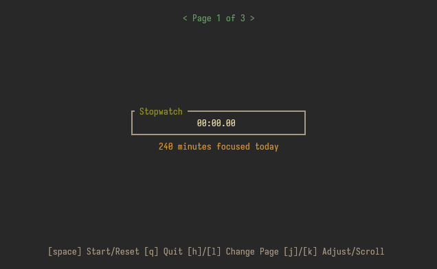
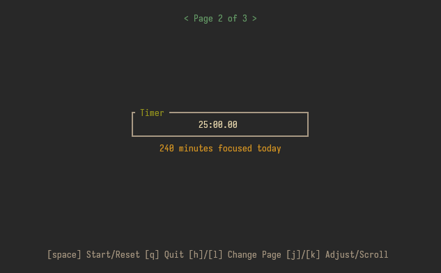
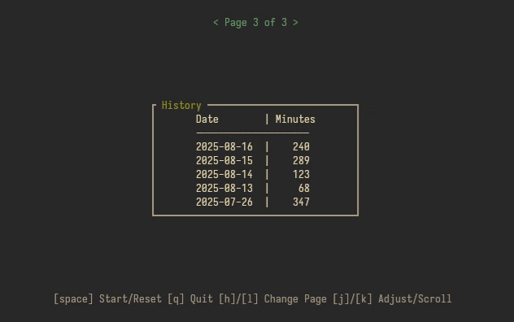

# fokus
A minimalist terminal‐based focus timer and stopwatch with daily logging, built in Rust

## Features
- Stopwatch to track elapsed time while focusing.
- Countdown timer with adjustable duration.
- Daily log of minutes focused saved in a local file at `~/.config/fokus/history.json`.
- Interactive terminal UI with pages for stopwatch, timer, and history.
- Vim-like control scheme.
- Distraction free minimalism.

## Screenshots






## Prerequisites
- Rust (>= 1.89)
#### Debian / Ubuntu
```bash
sudo apt update
sudo apt install rustc cargo
```
#### Fedora
```bash
sudo dnf install rust cargo
```

## Installation
#### Arch ([AUR](https://aur.archlinux.org/packages/fokus))
```bash
paru -S fokus
# or
yay -S fokus
```
#### Manual (Other Distros)
1. Clone the repository and open it:
```bash
git clone https://git.sr.ht/~fijarom/fokus
cd fokus
```
2. Build with Cargo and open it:
```bash
cargo build --release
cd target/release
```
3. (Optional) Install system-wide:
```bash
sudo install -Dm755 fokus /usr/local/bin/fokus
```

## Usage
Run the program:
```bash
./fokus
# or, if installed system-wide:
fokus
```
### Controls
- `[space]` : Start/Reset stopwatch or timer
- `[h/←]`/`[l/→]` : Switch pages
- `[j/↓]`/`[k/↑]` : Adjust timer minutes or scroll logs
- `[q]` : Quit
### Configuration
Configure fokus via the config file located at `~/.config/fokus/config.toml`:
# fokus Configuration File
```toml
# Default timer duration (in minutes)
# Must be between 1 and 999
default_timer_duration = 25
```

## LICENSE
This project is licensed under the terms of the GPL-3.0 license. See the [COPYING](./COPYING) file for details.

